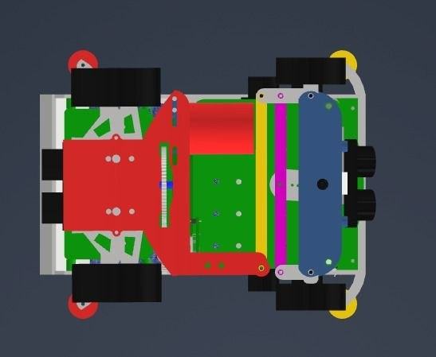
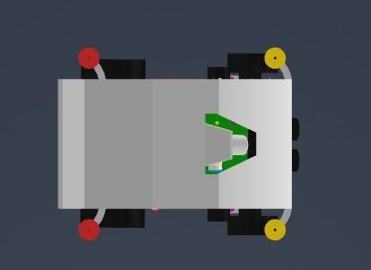
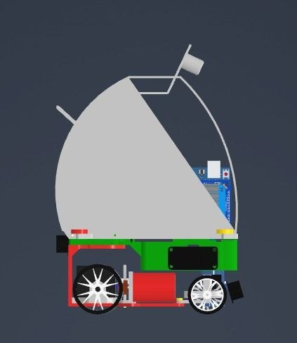
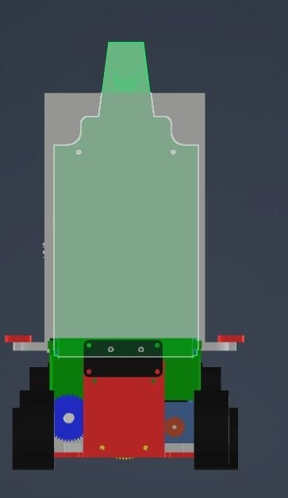
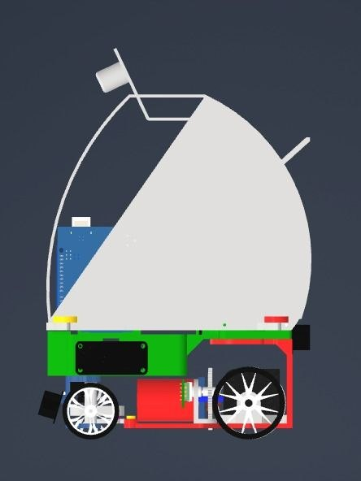
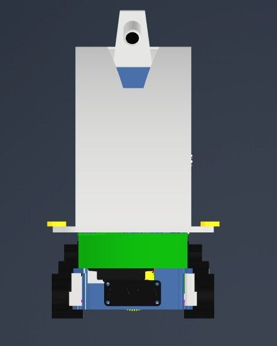

# CAD Model

We used this model to check where the chassis, drive motor, steering, electronics and covers fit. The six views below show the planned arrangement alongside the [vehicle photos](../README.md#vehicle-photos).

## Layout

| Part | Position and reason |
| --- | --- |
| Chassis | Supports the drivetrain and electronics, with heavier parts low and near the centre. |
| RC380 motor | Near the rear axle to keep the rear-wheel drivetrain compact. |
| MG996R steering servo | At the front, with clearance for the linkage and wheels to turn. |
| Jetson, Uno and driver | Mounted inside the frame, with room for wiring and access. |
| Camera | High at the front, facing the track without the cover blocking its view. |
| Ultrasonic sensors | Face outward so body panels do not sit in front of them. |
| Upper cover | Covers the electronics while allowing access for adjustments. |

## Why This Layout

Rear drive and front steering keep the mechanism straightforward. Keeping weight low helps stability in turns. Leaving space around the steering linkage lets us check that the wheels move without touching the cover.

The model helped us compare component positions before assembly and check the fit against the built car. These are layout views, not dimensioned manufacturing drawings. They show placement; the screenshots alone do not specify every mounting hole or printed-part dimension.

## CAD Views

### Top

### Bottom

### Left

### Rear

### Right

### Front

## Related Pages

[Parts](../hardware/) · [Wiring drawings](../schematic/) · [Body-part and steering tests](../testing/)
