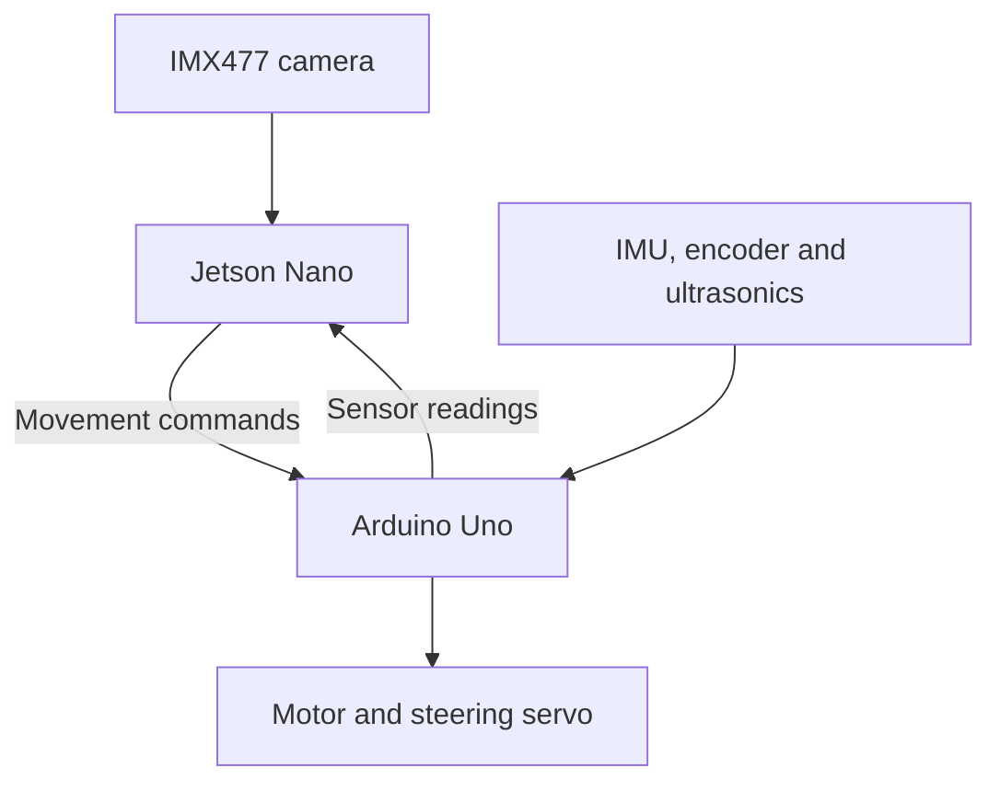

# IRD MAX - WRO Future Engineers

**Team #5865 | Riyadh, Saudi Arabia | 2026**

This is our self-driving car for WRO Future Engineers. We use a Jetson Nano to process the camera and an Arduino Uno to control the motor, steering and sensors.

The repository contains the code, parts list, CAD views, wiring drawings and test recordings. The journal explains problems we ran into, including straight-driving corrections and setting up remote access.

## Where to Start

| Looking for | Open |
| --- | --- |
| Install, upload and run instructions | [Software setup](software/SETUP.md) |
| Colour and encoder calibration | [Calibration tools](software/tools/) |
| Components and Arduino connections | [Hardware](hardware/) and [Uno pin map](hardware/PINOUT.md) |
| Mechanical layout | [CAD views](CAD/) |
| Wiring diagrams and signal connections | [Uno pin map](hardware/PINOUT.md) and [schematics](schematic/) |
| Recorded tests | [Testing](testing/) |
| Problems and changes | [Journal](Journal.md) |

## Team Information

| Detail | Information |
| --- | --- |
| Team name | IRD MAX |
| Team number | #5865 |
| Country | Saudi Arabia |
| City | Riyadh |
| Competition | WRO Future Engineers 2026 |
| Team member | Abdulaziz Nasser Al-Mindil |
| Team member | Mohamed Aldawood |
| Coach | Engineer Mohammed Emam |

### Team Photos

this is Abdulaziz Nasser Al-Mindil


and this is Mohamed Aldawood


## Our Vehicle

The current setup uses the **original NVIDIA Jetson Nano**, one IMX477 camera and an **Arduino Uno R3**. The Orin Nano/Mega rebuild archive is a separate reference, not the firmware and operating-system setup for this car.

| Board | Job |
| --- | --- |
| Jetson Nano | Camera frames, colour detection, driving decisions and serial commands. |
| Arduino Uno | Drive motor, steering servo, IMU, encoder, ultrasonic readings and start button. |

The RC380 motor drives the rear wheels. The MG996R servo steers the front wheels. The CAD page shows how the chassis, covers, camera and electronics fit around these parts.

The boards exchange commands and readings through USB serial at 115200 baud:



## Camera and Driving

Blue and orange floor lines help the programs identify corners. Red and green pillars identify the side the car should pass. The camera settings need to match the track lighting; a colour range that works in one room may include shadows or miss the target elsewhere.

The [colour sampler](software/tools/autotune_colors.py) lets us select the four colours from the camera image and save their HSV ranges. It writes the same YAML layout the current Python programs read. Its preview shows colour masks, not the full obstacle strategy: the driving code also has its own regions of interest, filters and thresholds.

The IMU supplies heading, also called yaw. The encoder estimates distance from wheel movement. Ultrasonic sensors provide nearby wall distances. These readings let the Jetson choose a movement, while the Uno produces the motor and servo signals.

The inventory contains four ultrasonic sensors. The Open Challenge controller reads front, left and right distances. The Obstacle Challenge controller also reads the rear sensor on D10 and reports encoder distance from A2/A3. Open does not use the encoder. The [pin map](hardware/PINOUT.md) separates these controller versions.

## Software and Calibration

The [software page](software/) lists each program. The slow comparison files use the same speeds and turns; one holds a straight target heading and the other keeps steering centered between corners. Both use the IMU for turns. Their comparison is documented in [the journal](Journal.md).

The calibration folder adds three practical tools:

- Colour sampling to create a new settings file without overwriting an existing one.
- Read-only yaw, ultrasonic and encoder checks, with optional CSV logging.
- An encoder-scale calculation based on rolling the car by hand over a measured distance.

These helpers are adapted to the uploaded Uno telemetry. They do not install new firmware or send driving commands. The archive's Mega motion tools and background service are not included.

## Repeating the Setup

Get a copy of this repository and record the commit ID:

```bash
git clone https://github.com/Abdulaziz-nasser/IRD-MAX.git
cd IRD-MAX
git rev-parse HEAD
```

Then follow [SETUP.md](software/SETUP.md). It covers the Python imports, OpenCV camera check, Arduino libraries, upload process, serial port, calibration and program launch directory.

For each test, keep the Python filename, Uno code version, colour YAML file and settings together. Check the program's printed configuration path before starting. The example YAML in this repository is labelled as starter data; it is not a measured field calibration.

Use the [challenge program pairs](software/README.md#competition-programs). `open_challenge.py` runs with `open_challenge_controller.ino`; `obstacle_challenge.py` runs with `obstacle_challenge_controller.ino`. The older `ird_max_controller.ino` is retained for development reference, not as the Obstacle Challenge controller. The Obstacle controller implements the distance commands and rear telemetry used by its Jetson program.

Keep drive-motor power disconnected during setup and calibration. For powered tests, raise the wheels first and keep a physical power disconnect available. The current Uno code has turn protection but no general stop-on-serial-loss watchdog; unplugging USB is not a reliable stop method.

## Testing and Changes

[Testing](testing/) contains the steering, body-part and track recordings with a short purpose, method and observation for each. The [test procedure](testing/PROCEDURE.md) explains what to record so another person can repeat a test.

Our [journal](Journal.md) keeps the problem, what we tried, the change and the observed result. The yaw comparison includes both Python files and video evidence. Failed attempts are useful when they show a problem clearly and can be linked to a specific change.

The calibration helpers also have offline checks:

```bash
python3 -m unittest discover -s software/tests -v
```

Those tests check calculations, file format and telemetry parsing. They do not claim the robot completed a challenge or that the physical sensors are calibrated.

## Competition Tasks

In the open challenge the car completes three laps and stops in the finish section. In the obstacle challenge it also passes red pillars on the right and green pillars on the left, then parks parallel to the wall.

The [official 2026 rules](https://wro-association.org/wp-content/uploads/WRO-2026-Future-Engineers-Self-Driving-Cars-General-Rules.pdf) give the full scoring and field requirements. For Saudi events, follow the local organizer's rules and updates.

## Vehicle Photos

**Front**


**Back**


**Left**


**Right**


**Top**


**Bottom**


## Repository Files

| Location | Contents |
| --- | --- |
| [hardware/](hardware/) | Component list, signal pin map and power notes. |
| [schematic/](schematic/) | Circuit diagram and machine schematic showing the team's connection layout. |
| [CAD/](CAD/) | Mechanical explanation and six CAD views. |
| [software/](software/) | Setup, current code, serial reference and calibration tools. |
| [testing/](testing/) | Videos, observations and repeatable test procedure. |
| [Journal.md](Journal.md) | Troubleshooting and the yaw comparison. |


