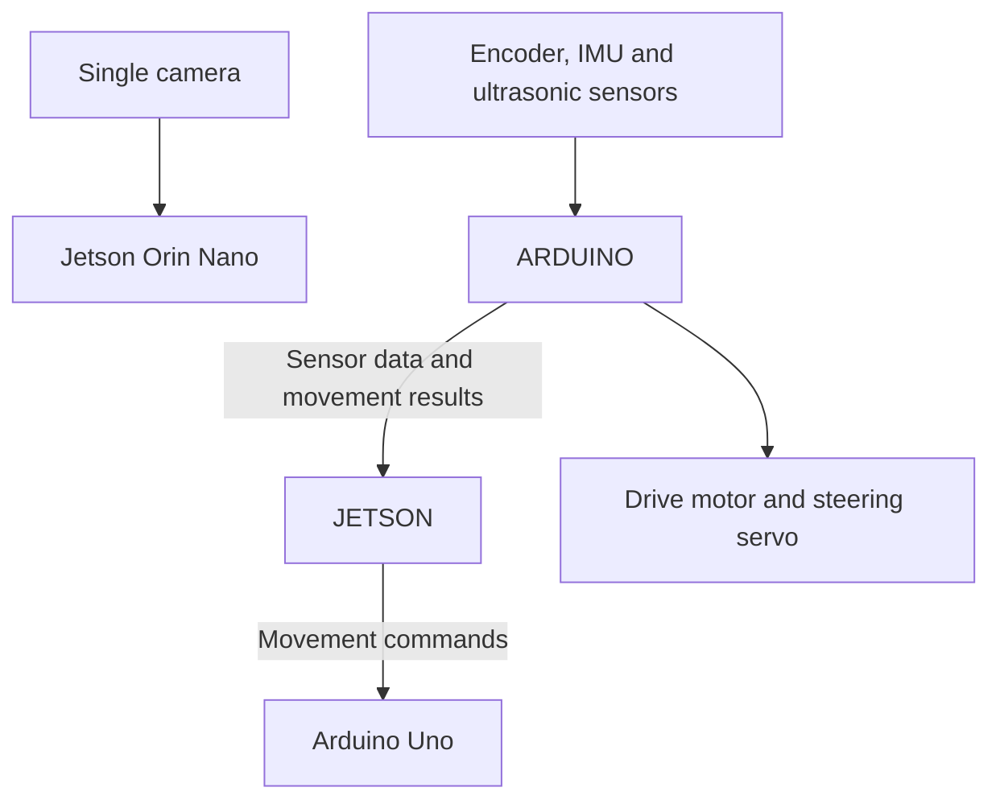

# IRD MAX - WRO Future Engineers

**Team #5865 | Riyadh, Saudi Arabia | 2026**

We are building a self-driving car for the **WRO Future Engineers** competition. Our aim is to complete the track, pass obstacles on the correct side, and park without manual control.

Here we document the car, our design choices, and what we learn during testing.

> \*\*Project status:\*\* The car is still being built and tested. We will add photos, performance videos, final hardware details, and test results as they become available.

## Team Information

|Detail|Information|
|-|-|
|**Team name**|IRD MAX|
|**Team number**|#5865|
|**Country**|Saudi Arabia|
|**City**|Riyadh|
|**Competition**|WRO Future Engineers 2026|
|**Team member**|Abdulaziz Nasser Al-Mindil|
|**Team member**|Mohamed Aldawood|
|**Coach**|Engineer Mohammed Emam|

### Team Photos

this is Abdulaziz Nasser Al-Mindil

and this is Mohamed Aldawood

## Our Vehicle

Our car uses an **NVIDIA Jetson Orin Nano**, **one camera**, and an **Arduino Uno**. Each board has a different job:

|Board|What it handles|
|-|-|
|**Jetson Orin Nano**|Camera processing, colour detection, driving decisions, and logging|
|**Arduino Uno**|Drive motor, steering servo, encoder, IMU, ultrasonic sensors, and start control|

This lets the Jetson focus on the camera and driving decisions while the Arduino Uno handles movement and sensor readings.

The boards communicate through **USB serial**:

## How the Car Works

### Camera and Colour Detection

The camera looks for **blue and orange floor lines** to help identify corners, and **red and green pillars** to decide which side to pass.

The colour calibration tool adjusts detection to the track lighting. It shares its vision code and settings with the driving program.

### Driving and Sensor Feedback

The Jetson uses the camera and sensor readings to decide when to drive, turn, or stop. The Arduino Uno carries out these commands and sends readings back to the Jetson.

The **IMU** measures heading, also called yaw, to help the car stay straight and make turns. The **encoder** estimates distance travelled, and the **ultrasonic sensors** measure the space around the car.

Our control design includes movement timeouts and a motor stop if communication is lost. These are checked during testing along with normal driving behaviour.

## Development and Testing

Our test plan starts with individual parts before moving on to complete runs:

1. Check the power supply and wiring.
2. Check communication between the Jetson and Arduino Uno.
3. Test motor direction and steering with the wheels raised.
4. Calibrate the encoder, yaw, and ultrasonic sensors.
5. Test the camera and colour detection under different lighting.
6. Try straight driving and corners at low speed.
7. Test obstacle avoidance, stopping, and recovery.
8. Attempt complete runs and parking.

Problems, changes, screenshots, and results will go in `testing/`. We will add full-run results after verifying them on the track.

## Competition Challenges

These are the tasks we are working towards.

### Open Challenge - Up to 30 Points

* Complete **three laps** autonomously.
* Follow the round's driving direction and handle changes to the inner wall layout.
* Stay on the track and stop in the finish section after the third lap.

### Obstacle Challenge - Up to 62 Points

* Complete **three laps** autonomously.
* Pass **red pillars on the right** and **green pillars on the left**.
* Avoid moving the pillars.
* Finish by parking fully inside the parking area, parallel to the wall.

The maximum also includes the bonus for starting inside the parking lot and completing at least one full lap.

These summaries use the [official WRO 2026 international rules](https://wro-association.org/wp-content/uploads/WRO-2026-Future-Engineers-Self-Driving-Cars-General-Rules.pdf). For Saudi events, the local organizer's rules and updates apply.

## Vehicle Photos

**front**

**Back**

**Left**

**Right**

**Top**

**Down**

## Performance Video

**Full run: coming soon.**

!addlink

## Repository Structure

We are organizing the repository using this layout:

|Location|Contents|
|-|-|
|`README.md`|Project overview, team information, photos, and performance video|
|`hardware/`|Parts, wiring diagrams, power connections, and pin assignments|
|`software/jetson/`|Python vision and driving code, settings, and calibration tools|
|`software/controller/`|Arduino Uno code for the motor, steering, and sensors|
|`CAD/`|Chassis, mounts, and other 3D design files|
|`testing/`|testing each necessary parts in the car|

