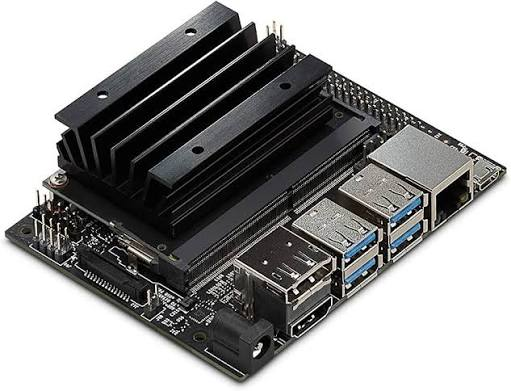
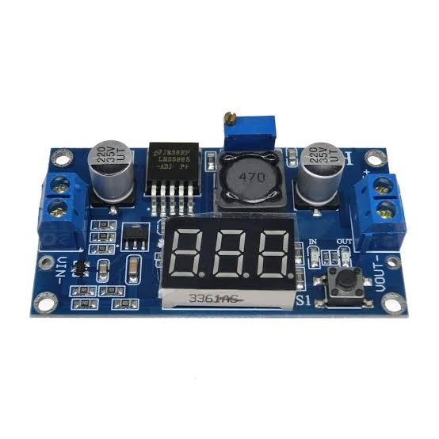

# Hardware

The Jetson processes camera images and sends driving commands to the Arduino Uno over USB. The Arduino controls the RC380 motor and MG996R steering servo and reads the sensors.

Use the [Uno pin map](PINOUT.md) to check signal connections and the [power notes](power/) for supply information.

| Component | Quantity | Photo or reference |
|---|---|---|
| NVIDIA Jetson Nano | 1 |  |
| Arduino Uno R3 with shield | 1 |   |
| HW-039 module | 1 |  |
| IMX477 camera | 1 |  |
| DFRobot ultrasonic sensors | 4 |  |
| DFRobot BNO055 9-axis IMU | 1 |  |
| RC380 brushed drive motor, marked 7.2 V | 1 | [Installed vehicle views](../README.md#vehicle-photos). Use the actual motor label; a generic RS380 listing is not its datasheet. |
| **MG996R steering servo** | 1 |  |
| **Rotary encoder** | 1 |  |
| Buzzer | 1 |  |
| Battery cell holder | 1 |  |
| DC-DC step-down regulator | See power notes |  |
| Start button | 1 |  |

Most photos are product references, not identification photos of the installed parts. Check the label on the actual component before using a linked product's voltage or current rating.

Wiring: [circuit diagram](../schematic/circuit-diagram.png) and [machine schematic](../schematic/machine-schematic.png).

The inventory lists four ultrasonic sensors. The Open controller reads front, left and right; the Obstacle controller also reads rear distance on D10. Encoder inputs A2/A3 are used by the Obstacle and older development controllers, not the Open controller. See the [version-specific pin map](PINOUT.md).

The documented computer is the original Jetson Nano, not the Orin Nano. Product-reference images illustrate component families; the vehicle photos and actual part labels identify the installed build.

1