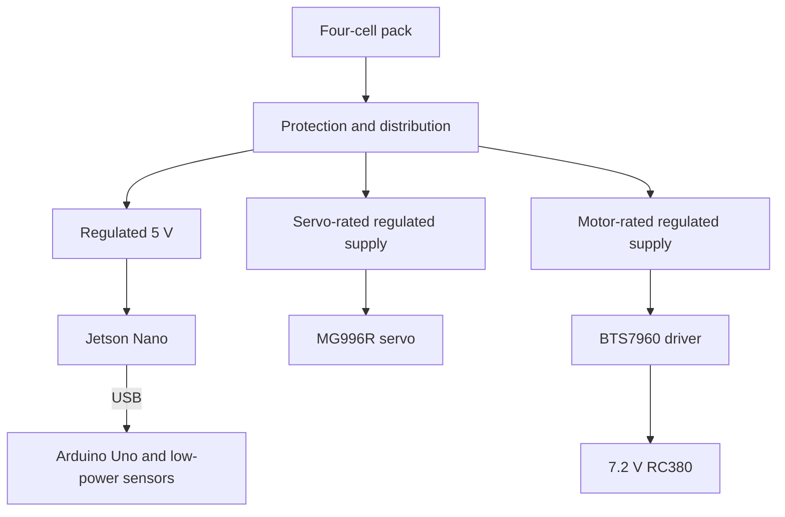

# Power Notes

The car uses a holder with four lithium cells labelled 5000 mAh. The holder output was reported as approximately 15–18 V. The computer currently installed is the original Jetson Nano, and the RC380 drive motor is marked 7.2 V.

These details are not enough to identify the cell chemistry, charging limit or regulator current ratings. Check the labels and datasheets with the coach or an experienced adult before wiring or charging the pack.

## Battery Values

| Item | Recorded information |
| --- | --- |
| Cells | Four, reported as connected in series. |
| Capacity label | 5000 mAh per cell; a 4S1P pack retains 5000 mAh capacity. |
| Nominal voltage | About 14.8 V if each cell is nominally 3.7 V. |
| Reported holder reading | Approximately 15–18 V; not a logged load test. |
| Charging limit | Must come from the exact cell manufacturer's specification. Do not assume a 4.4 V charge limit. |

The reported voltage range should be verified with a meter. It does not establish a safe charging limit or prove that individual cells are balanced.

## Regulated Supply Reference

The diagram below shows separate regulated branches. It is a wiring reference, not proof that every regulator or protection part is fitted to the current vehicle.

| Branch | Supply requirement to check |
| --- | --- |
| Jetson Nano | Regulated 5 V at the correct input. NVIDIA's barrel-input guidance specifies up to 4 A for demanding loads on the applicable developer kit. |
| Uno and sensors | USB/logic supply with the correct sensor-board voltages and enough current for the connected devices. |
| MG996R servo | Supply matched to the exact servo's voltage and peak-current requirements; do not load the Uno 5 V pin with the steering motor. |
| RC380 drive motor | Supply matched to the motor's 7.2 V rating, through its driver. A motor driver's voltage rating does not make battery voltage suitable for the motor. |

A step-down regulator reduces voltage; an ordinary buck converter does not provide galvanic isolation. Ground and high-current wiring need to be planned together.

The earlier wiring description included a battery-to-motor-driver branch without a step-down regulator. Do not copy that branch as a safe 7.2 V motor supply from a 15–18 V pack. Have the actual connection checked before powering the drivetrain.

## Sensors and Placement

| Device | Role and check |
| --- | --- |
| BNO055 IMU | Provides yaw. Secure its mounting, note axis direction and keep it away from motor magnetic fields where practical. Check readings while rotating the car by hand. |
| Ultrasonic sensors | Measure space around the car. Compare readings with known distances and make sure the body does not block the sensing faces. |
| Encoder | Measures drivetrain movement. The uploaded code uses 624 counts per 10 cm; the [manual calibration tool](../../software/tools/) checks that scale. |
| IMX477 camera | Connects to the Jetson through CSI. Check its view with the cover fitted and sample colours under the track lighting. |

The parts inventory lists four ultrasonic sensors, but the current Uno firmware publishes only front, left and right distances. See [the pin map](../PINOUT.md) for the software-supported connections.

## Checks to Record

With qualified supervision, record the actual regulator model and output for each connected load. Check the output before attaching electronics and again under the intended load. Keep measured values separate from intended setpoints.

A useful power check records supply voltage, current where measurable, any reset or shutdown, and heating observed during the test. Fuse, pack-protection and switch details must match the installed hardware; a diagram alone does not establish that protection is present.

This repository does not contain a measured current budget or regulator load-test table. The documented supply reference should not be presented as completed electrical validation.

[NVIDIA Jetson Nano Developer Kit User Guide](https://developer.nvidia.com/embedded/dlc/jetson_nano_developer_kit_user_guide)
