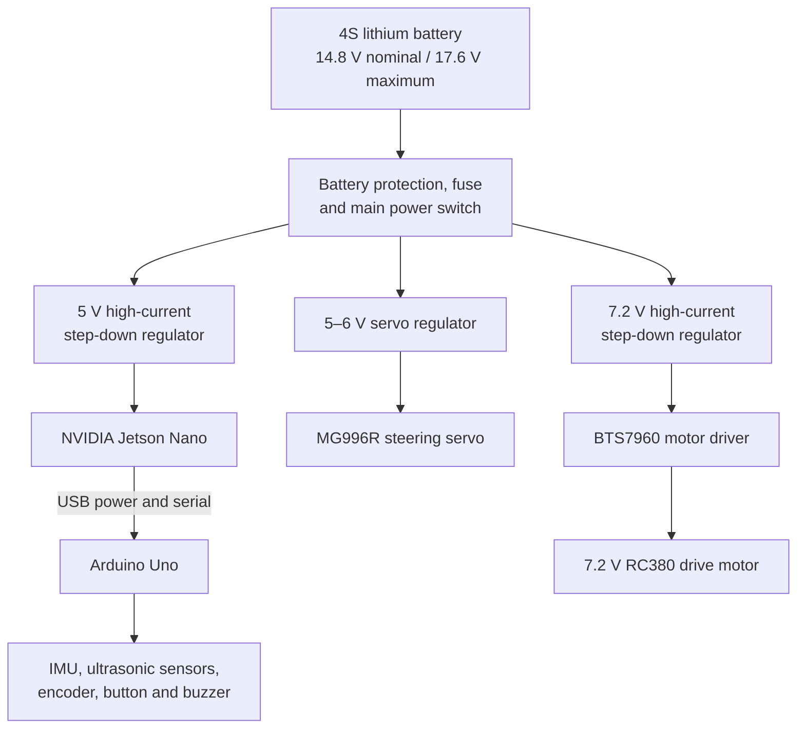

# Power System

The IRD MAX robot uses one four-cell lithium battery pack to supply the computer, controller, sensors, steering servo, and drive motor. The pack voltage is divided into separate regulated power rails so each part receives the voltage it was designed for.

## Battery Pack

The battery holder contains four 5000 mAh lithium cells connected in series.

| Battery value | Specification |
| --- | --- |
| Cell voltage | 3.7 V nominal, up to 4.4 V fully charged |
| Cell capacity | 5000 mAh |
| Pack configuration | 4S1P |
| Pack voltage | 14.8 V nominal, up to 17.6 V fully charged |
| Pack capacity | 5000 mAh |
| Nominal stored energy | About 74 Wh |

Connecting cells in series increases the voltage but does not add their capacities together. This is why the complete pack remains 5000 mAh instead of becoming 20,000 mAh.

## Power Distribution

All control grounds are connected to a common ground. The high-current motor and servo wiring is kept separate from the Jetson and sensor wiring until the common distribution point. This helps reduce electrical noise and prevents motor current spikes from disturbing the computer or sensor readings.

## Power Rails

| Rail | Powered parts | Reason |
| --- | --- | --- |
| Regulated 5 V | Jetson Nano | The Jetson needs a stable 5 V input. The supply is sized for up to 4 A so the board can run camera processing without voltage drops. |
| USB 5 V | Arduino Uno and low-power sensors | The USB cable provides power and the 115200-baud serial connection between the Jetson and Arduino. |
| Regulated 5–6 V | MG996R steering servo | The servo has its own supply because its sudden current demand could reset the Arduino or disturb the sensors. |
| Regulated 7.2 V | BTS7960 and RC380 motor | The motor is rated for 7.2 V, so the 4S battery voltage is reduced before reaching the motor driver. |

## Jetson Nano Supply

The Jetson Nano is powered through its DC barrel input using a regulated 5 V supply. NVIDIA specifies a 5 V, 4 A supply for demanding workloads and attached peripherals. The J48 power-select jumper is fitted when the J25 barrel input is used.

The step-down regulator isolates the Jetson from the battery voltage, which can vary from approximately 14.8 V during normal use to 17.6 V at full charge. Supplying the battery voltage directly would damage the Jetson.

## Arduino and Sensors

The Arduino Uno connects to the Jetson Nano by USB. This cable carries both 5 V power and serial data. The Arduino supplies the low-power devices used by the controller:

- DFRobot BNO055 IMU
- DFRobot ultrasonic sensors
- Rotary encoder
- Start button
- Buzzer

The sensors share the Arduino ground, and the Arduino ground is connected to the main common ground through the USB and power system. Keeping the sensor rail separate from the drive motor wiring reduces noise in the IMU, encoder, and distance readings.

The IMX477 camera connects directly to the Jetson Nano through the CSI interface. Its power is therefore included in the Jetson rail rather than the Arduino sensor rail.

## Sensor Placement and Calibration

| Sensor | Placement and purpose | Calibration or check |
| --- | --- | --- |
| BNO055 IMU | Mounted securely near the center of the chassis and away from the drive motor. It provides the yaw angle used to drive straight and complete accurate turns. | The IMU calibration status is checked after startup, and its zero heading is confirmed before a run. |
| Ultrasonic sensors | Positioned at the front, left, right, and rear so the robot can measure wall distance and check its parking position. The body does not block their sensing direction. | Each sensor is compared with known distances, and incorrect or out-of-range readings are rejected in software. |
| Rotary encoder | Connected to the drivetrain to measure movement instead of estimating distance from time alone. | The measured value is 624 counts per 10 cm and is checked using a marked straight-line test. |
| IMX477 camera | Mounted high and facing forward so the vehicle body does not block its view of the lane and obstacle pillars. | The camera position is checked on the competition field so both pillar colors and the required driving area remain visible. |

These positions were chosen to give the control software independent information about heading, traveled distance, nearby walls, and obstacle colors. Using several sensor types also allows the robot to continue making controlled decisions when one reading is temporarily unreliable.

## Motor and Steering Power

The RC380 drive motor is rated for 7.2 V. The battery pack can reach 17.6 V, so it is not connected directly to the motor driver. A separate high-current step-down regulator reduces the battery voltage to 7.2 V before the BTS7960 controls the motor.

The MG996R steering servo also uses a separate 5–6 V regulator. It is not powered from the Arduino 5 V pin because the servo can draw a short burst of high current while turning or holding the wheels under load.

## Protection and Reliability

- A battery protection system is used for the four-cell series pack.
- A fuse protects the wiring if a short circuit or stalled motor causes excessive current.
- The main switch disconnects the full battery pack from every power branch.
- Each regulator is rated for the continuous and peak current of its connected load.
- Power cables for the motor and servo are separated from signal wires where possible.
- Connectors are insulated and secured so vibration cannot loosen them during a run.
- The Jetson, Arduino, sensors, servo regulator, and BTS7960 share a controlled common ground.

## Power Checks

Before connecting the electronics, each regulator output is checked separately. The Jetson rail is verified at 5 V, the servo rail at 5–6 V, and the motor rail at 7.2 V. The voltage is checked again while the camera, motor, and steering servo are running together to confirm that the regulators do not drop below their required output.

During testing, we also check the battery connectors, regulators, motor driver, and wiring for unusual heating. These checks help prevent unexpected Jetson shutdowns, Arduino resets, unstable sensor readings, and damage to the 7.2 V motor.

## Reference

- [NVIDIA Jetson Nano Developer Kit User Guide](https://developer.nvidia.com/embedded/dlc/jetson_nano_developer_kit_user_guide)
