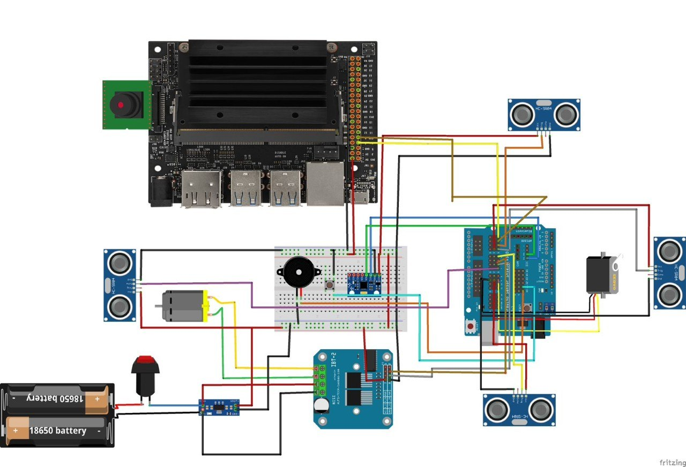
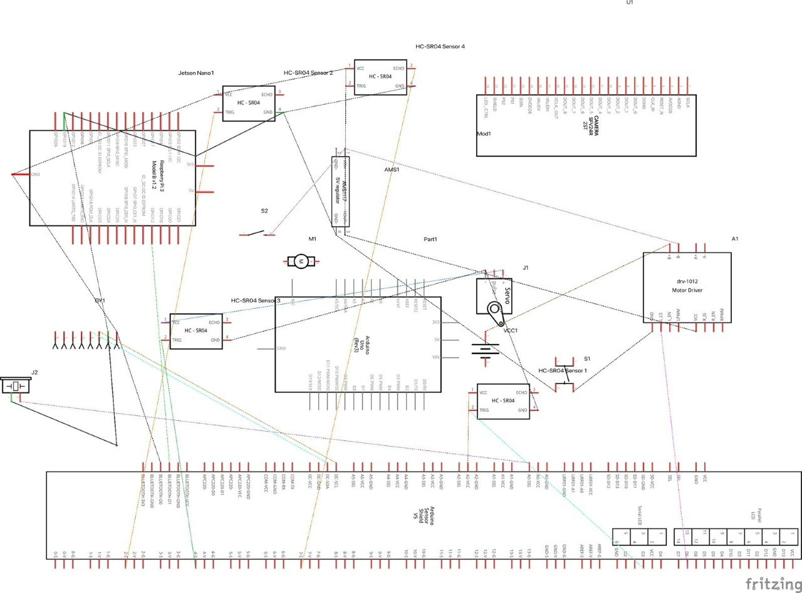

# Schematics

These diagrams show how we connect the components in our robot.

Use the [hardware list](../hardware/) for the installed component names, the [Uno pin map](../hardware/PINOUT.md) for pin assignments in each controller version, and the [power notes](../hardware/power/) for supply details.

## Circuit Diagram

This diagram shows how we connect our controller, sensors, motor driver, steering servo and power components.

## Machine Schematic

This drawing shows the same connections as a machine schematic. Our robot uses the original Jetson Nano, Arduino Uno R3, IMX477 camera and BTS7960 motor driver.

The [CAD page](../CAD/) shows the mechanical arrangement from six directions.

