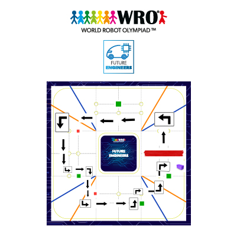

# Software

The Jetson reads the camera and decides what to do. The Arduino Uno reads the sensors and controls the drive motor and steering. They communicate over USB serial at 115200 baud.

## Obstacle Challenge Strategy

We marked this field layout to show an example route around the pillars. The black arrows show the direction of travel and the turns along the route.

- **Red pillar:** pass on its right.
- **Green pillar:** pass on its left.

The camera detects the pillar colour so the car can choose which side to pass. After passing a pillar, it returns to its straight heading and continues toward the next corner.

## Start here

1. Follow [SETUP.md](SETUP.md) to check the environment, upload the correct Arduino code and connect serial.
2. Use the [calibration tools](tools/README.md) with drive-motor power disconnected.
3. Follow the [test procedure](../testing/PROCEDURE.md) before running on the track.

## Competition programs

Upload the Arduino controller that matches the Jetson program for the selected challenge.

| Challenge | Jetson program | Arduino controller |
| --- | --- | --- |
| Open Challenge | [open_challenge.py](jetson/open_challenge.py) | [open_challenge_controller.ino](controller/open_challenge_controller.ino) |
| Obstacle Challenge | [obstacle_challenge.py](jetson/obstacle_challenge.py) | [obstacle_challenge_controller.ino](controller/obstacle_challenge_controller.ino) |

The Open Challenge pair handles intersection-colour detection, heading correction, corner turns and the final stopping sequence. The Obstacle Jetson program contains pillar-avoidance and parking states; its Arduino controller adds rear-distance telemetry and encoder-distance movement. These descriptions identify code functions, not measured completion rates.

## Other software files

| File | What it does |
| --- | --- |
| [jetson/slow_with_yaw.py](jetson/slow_with_yaw.py) | Slow open-track comparison with straight-heading correction. |
| [jetson/slow_without_yaw.py](jetson/slow_without_yaw.py) | Matching comparison with centered steering between corners. It still uses yaw for turns. |
| [controller/ird_max_controller.ino](controller/ird_max_controller.ino) | Older development controller: three ultrasonics and encoder telemetry, without distance-movement commands. |
| [tools/autotune_colors.py](tools/autotune_colors.py) | Samples four track colours and writes HSV settings in the format the programs read. |
| [tools/encoder_calibrate.py](tools/encoder_calibrate.py) | Calculates an encoder-scale correction from a measured, hand-rolled distance. |
| [tools/sensor_check.py](tools/sensor_check.py) | Displays yaw, distances and encoder readings; it can also save them to CSV. |
| [jetson/config/](jetson/config/) | Colour-file format and a labelled example. |
| [tests/test_calibration.py](tests/test_calibration.py) | Offline checks for calibration maths, file saving and telemetry parsing. |

The calibration tools were adapted from the supplied one-camera rebuild source. The rebuild's Mega firmware, mission code and OS installer are not part of this setup. See [the source notes](tools/README.md#source-and-compatibility).

## What runs where

The camera connects to the Jetson. The selected Python program opens the camera, loads its colour settings, receives sensor readings and sends movement commands. The matching Arduino program handles motor output, steering and sensor telemetry.

The slow comparison programs differ in one setting: `STRAIGHT_YAW_ENABLED`. Their matching speeds and turn settings let us compare straight driving without changing both variables at once. The recordings are in [the yaw journal entry](../Journal.md#problem-3--yaw-and-straight-driving).

## Controller compatibility

The Open and Obstacle Challenge programs use different controller files because their sensor and movement requirements are different. Always use the matched pair in the competition-program table above.

The Open controller reports front, left and right distances, without encoder telemetry. The Obstacle controller reports those distances plus `dB` and `enc_cm`, and accepts `FWD_CM` / `BACK_CM`. Parking decisions remain in the Jetson program.

Do not substitute the older `ird_max_controller.ino` for the Obstacle controller: it lacks rear telemetry and distance moves, and its `BACK` prefix can misread `BACK_CM`. The [serial reference](PROTOCOL.md) lists commands separately for all three controllers.

The original source defaults to `/dev/ttyUSB0`. The [setup commands](SETUP.md#4-find-the-serial-port) explicitly select `/dev/ttyACM0` for the replacement Uno R3 without changing the robot's saved tuning. Use the actual listed port if its number differs.
